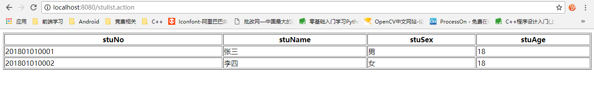

# SpringMVC框架

## 1 什么是SpringMVC框架

springmvc是spring框架的一个模块，springmvc和spring无需通过中间整合层进行整合。

springmvc是一个基于mvc的web框架。

<div align=center>

​	

</div>

## 2 mvc在b/s系统 下的应用

mvc是一个设计模式，mvc在b/s系统 下的应用：

<div align=center>

​	

</div>

## 3 SpringMVC框架

<div align=center>

​	

</div>

**组件：**

- 前端控制器DispatcherServlet（不需要程序员开发）

  作用：接收请求，响应结果，相当于转发器，中央处理器。有了DispatcherServlet减少了其它组件之间的耦合度。

- 处理器映射器HandlerMapping(不需要程序员开发)

  作用：根据请求的url查找Handler

- 处理器适配器HandlerAdapter

  作用：按照特定规则（HandlerAdapter要求的规则）去执行Handler

- 处理器Handler(需要程序员开发)

  注意：编写Handler时按照HandlerAdapter的要求去做，这样适配器才可以去正确执行Handler

- 视图解析器View resolver(不需要程序员开发)

  作用：进行视图解析，根据逻辑视图名解析成真正的视图（view）

- 视图View(需要程序员开发jsp)

  View是一个接口，实现类支持不同的View类型（jsp、freemarker、pdf...）


## 4 示例程序

1. 在IntelliJ IDEA中新建SpringMVC项目，如下图：

   <div align=center>

   ​	

   </div>

   <div align=center>

   ​	

   </div>

2. 项目创建后，找到 WEB-INF 目录中的 *web.xml* 文件，在里面添加配置信息：

   ```xml
   <context-param>
       <param-name>contextConfigLocation</param-name>
       <param-value>/WEB-INF/applicationContext.xml</param-value>
   </context-param>
   <listener>
       <listener-class>org.springframework.web.context.ContextLoaderListener</listener-class>
   </listener>
   <servlet>
       <servlet-name>dispatcher</servlet-name>
       <servlet-class>org.springframework.web.servlet.DispatcherServlet</servlet-class>
   
       <init-param>
           <param-name>contextConfigLocation</param-name>
           <param-value>classpath:springmvc.xml</param-value>
       </init-param>
       <!--<load-on-startup>1</load-on-startup>-->
   </servlet>
   <servlet-mapping>
       <servlet-name>dispatcher</servlet-name>
       <url-pattern>*.action</url-pattern>
   </servlet-mapping>
   ```

3. 在src目录下，创建所需要的包和文件：

   <div align=center>

   ​	

   </div>

   1. 在添加的 *springmvc.xml* 文件中，配置相关信息：

      ```xml
      <beans xmlns="http://www.springframework.org/schema/beans"
             xmlns:xsi="http://www.w3.org/2001/XMLSchema-instance" xmlns:mvc="http://www.springframework.org/schema/mvc"
             xmlns:context="http://www.springframework.org/schema/context"
             xmlns:aop="http://www.springframework.org/schema/aop" xmlns:tx="http://www.springframework.org/schema/tx"
             xsi:schemaLocation="http://www.springframework.org/schema/beans
            http://www.springframework.org/schema/beans/spring-beans-3.2.xsd
            http://www.springframework.org/schema/mvc
            http://www.springframework.org/schema/mvc/spring-mvc-3.2.xsd
            http://www.springframework.org/schema/context
            http://www.springframework.org/schema/context/spring-context-3.2.xsd
            http://www.springframework.org/schema/aop
            http://www.springframework.org/schema/aop/spring-aop-3.2.xsd
            http://www.springframework.org/schema/tx
            http://www.springframework.org/schema/tx/spring-tx-3.2.xsd ">
      
          <!-- 处理器映射器 -->
          <bean class="org.springframework.web.servlet.handler.BeanNameUrlHandlerMapping"></bean>
          <!-- 处理器适配器:要求handler必须实现Controller接口 -->
          <bean class="org.springframework.web.servlet.mvc.SimpleControllerHandlerAdapter"></bean>
          <!-- 配置handller -->
          <bean id="StudentController" name="/stulist.action" class="me.syaokyo.controller.StudentController"></bean>
      
          <!-- 另一个处理器映射器 -->
          <bean class="org.springframework.web.servlet.handler.SimpleUrlHandlerMapping">
              <property name="mappings">
                  <props >
                      <prop key="/abc.action">StudentController2</prop>
                      <prop key="/aaa.action">StudentController2</prop>
                  </props>
              </property>
          </bean>
          <!-- 另一个处理器适配器：要求handler必须实现HttpRequestHandler接口 -->
          <bean class="org.springframework.web.servlet.mvc.HttpRequestHandlerAdapter"></bean>
          <!-- 配置handller -->
          <bean id="StudentController2" name="/reqlist.action" class="me.syaokyo.controller.StudentController2"></bean>
      
          <!-- 注解的方式配置处理器适配器和处理器映射器 -->
          <bean class="org.springframework.web.servlet.mvc.method.annotation.RequestMappingHandlerMapping"></bean>
          <bean class="org.springframework.web.servlet.mvc.method.annotation.RequestMappingHandlerAdapter"></bean>
          <!-- 注解二合一 -->
          <mvc:annotation-driven></mvc:annotation-driven>
          <!-- 配置handller -->
           <!--<bean class="me.syaokyo.controller.StudentController3"></bean>-->
          <!-- 对于注解的Handler建议使用组件扫描-->
          <context:component-scan base-package="me.syaokyo.controller"></context:component-scan>
      
          <!-- 视图解析器 -->
          <bean class="org.springframework.web.servlet.view.InternalResourceViewResolver"></bean>
      
      </beans>
      ```

   2. 在 *entity* 中添加实体类 *Student* ：

      ```java
      package me.syaokyo.entity;
      
      /**
       * Created by SyaoKyo on 2018/9/5.
       */
      public class Student {
          private String stuNo;
          private String stuName;
          private String stuSex;
          private int stuAge;
      
          public Student(String stuNo, String stuName, String stuSex, int stuAge) {
              this.stuNo = stuNo;
              this.stuName = stuName;
              this.stuSex = stuSex;
              this.stuAge = stuAge;
          }
      
          public Student() {
          }
      
          public String getStuNo() {
              return stuNo;
          }
      
          public void setStuNo(String stuNo) {
              this.stuNo = stuNo;
          }
      
          public String getStuName() {
              return stuName;
          }
      
          public void setStuName(String stuName) {
              this.stuName = stuName;
          }
      
          public String getStuSex() {
              return stuSex;
          }
      
          public void setStuSex(String stuSex) {
              this.stuSex = stuSex;
          }
      
          public int getStuAge() {
              return stuAge;
          }
      
          public void setStuAge(int stuAge) {
              this.stuAge = stuAge;
          }
      }
      ```

   3. 在 *controller* 中添加三种类型的控制器，我分别是 *StudentController* (实现Controller接口，重写handleRequest方法)、 *StudentController2* （实现HttpRequestHandler接口，实现handleRequest方法）、 *StudentController3* （注解方式）：

      1. StudentController：

         ```java
         package me.syaokyo.controller;
         
         
         import me.syaokyo.entity.Student;
         import org.springframework.web.servlet.ModelAndView;
         import org.springframework.web.servlet.mvc.Controller;
         
         import javax.servlet.http.HttpServletRequest;
         import javax.servlet.http.HttpServletResponse;
         import java.util.ArrayList;
         
         
         /**
          * Created by SyaoKyo on 2018/9/5.
          */
         public class StudentController implements Controller {
         
             @Override
             public ModelAndView handleRequest(HttpServletRequest arg0, HttpServletResponse arg1)
                     throws Exception {
                 ArrayList<Student> list = new ArrayList<>();
                 list.add(new Student("201801010001","张三","男",18));
                 list.add(new Student("201801010002","李四","女",18));
                 //创建ModelAndView
                 ModelAndView mv = new ModelAndView();
                 //相当于rquest.setAttribute()
                 mv.addObject("list", list);
                 //指定要跳转的jsp
                 mv.setViewName("/index.jsp");
                 return mv;
             }
         }
         ```

      2. StudentController2：

         ```java
         package me.syaokyo.controller;
         
         import me.syaokyo.entity.Student;
         import org.springframework.web.HttpRequestHandler;
         
         import javax.servlet.ServletException;
         import javax.servlet.http.HttpServletRequest;
         import javax.servlet.http.HttpServletResponse;
         import java.io.IOException;
         import java.util.ArrayList;
         
         /**
          * Created by SyaoKyo on 2018/9/5.
          */
         public class StudentController2 implements HttpRequestHandler {
         
             @Override
             public void handleRequest(HttpServletRequest arg0, HttpServletResponse arg1)
                     throws ServletException, IOException {
         
                 ArrayList<Student> list = new ArrayList<>();
                 list.add(new Student("201801010001","张三","男",18));
                 list.add(new Student("201801010002","李四","女",18));
                 list.add(new Student("201801010001","张三","男",18));
                 list.add(new Student("201801010002","李四","女",18));
                 arg0.setAttribute("list", list);
                 //指定要跳转的jsp
                 arg0.getRequestDispatcher("/index.jsp").forward(arg0, arg1);
             }
         }
         ```

      3. StudentController3：

         ```java
         package me.syaokyo.controller;
         
         import me.syaokyo.entity.Student;
         import org.springframework.stereotype.Controller;
         import org.springframework.web.bind.annotation.RequestMapping;
         import org.springframework.web.servlet.ModelAndView;
         
         import java.util.ArrayList;
         
         /**
          * Created by SyaoKyo on 2018/9/5.
          */
         @Controller
         public class StudentController3 {
         
             @RequestMapping("/stus")
             public ModelAndView queryStuList(){
                 ArrayList<Student> list = new ArrayList<>();
                 list.add(new Student("201801010001","张三","男",18));
                 list.add(new Student("201801010002","李四","女",18));
                 list.add(new Student("201801010001","张三","男",18));
                 list.add(new Student("201801010002","李四","女",18));
                 list.add(new Student("201801010001","张三","男",18));
                 list.add(new Student("201801010002","李四","女",18));
                 //创建ModelAndView
                 ModelAndView mv = new ModelAndView();
                 //相当于rquest.setAttribute()c
                 mv.addObject("list", list);
                 //指定要跳转的jsp
                 mv.setViewName("/index.jsp");
                 return mv;
             }
         }
         ```

   4. 将程序部署在Tomcat上

      <div align=center>

      ​	

      </div>

      <div align=center>

      ​	

      </div>

      <div align=center>

      ​	

      </div>

   5. 以上就完成了简单的SpringMVC框架的搭建


## 5 运行结果

1. 通过实现Controller接口，重写handleRequest方法：***(/stulist.action)***

   <div align=center>

   ​	

   </div>

2. 实现HttpRequestHandler接口，实现handleRequest方法：***(/aaa.action or /abc.action)***

   <div align=center>

   ​	

   </div>

3. 注解方式：***(/stus.action)***

   <div align=center>

   ​	

   </div>


